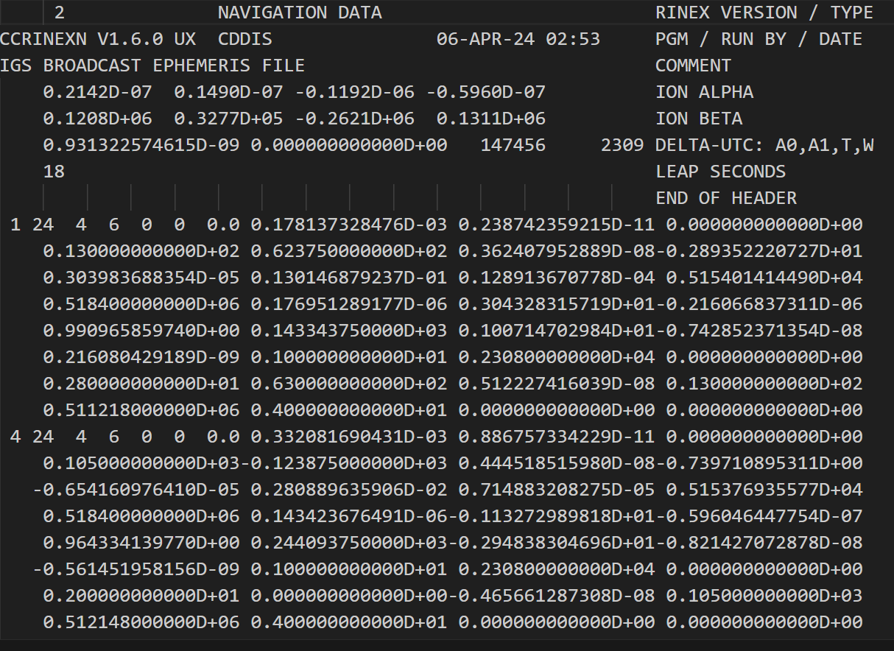
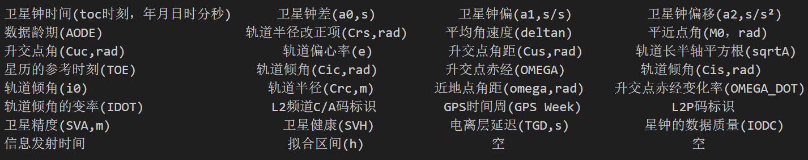
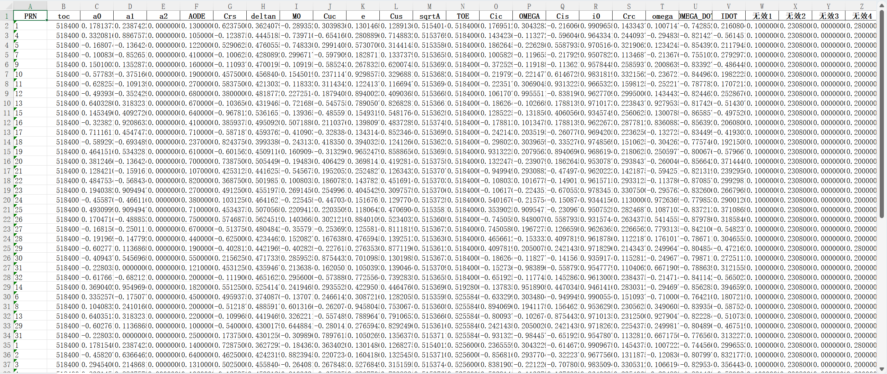
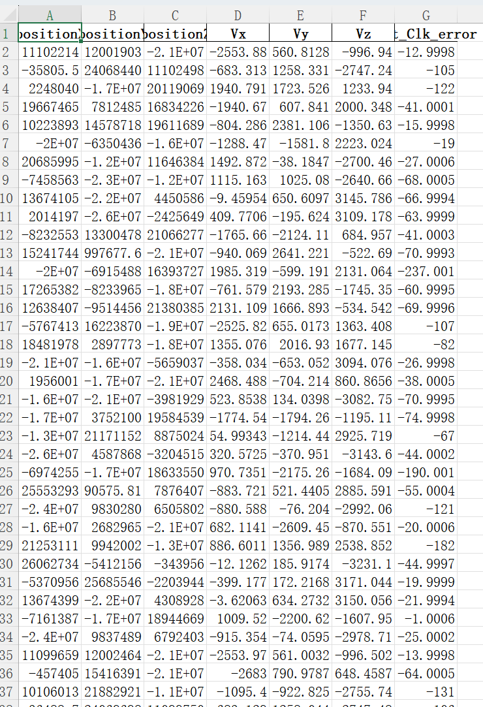
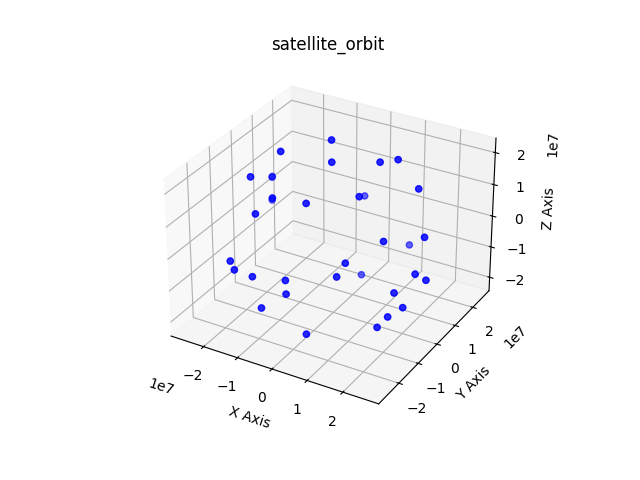
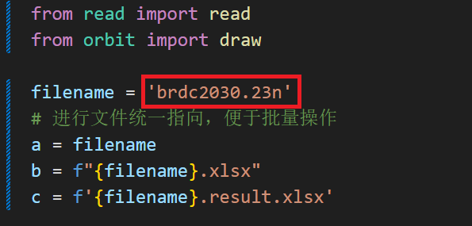
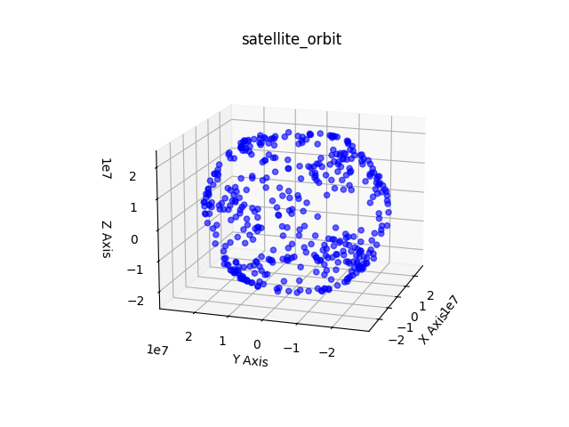

# 功能介绍
基于python对GPS卫星广播星历，进行卫星位置及运动参数解算

## 首先使用NASA提供的GPS卫星广播星历，[点击这里](https://urs.earthdata.nasa.gov/)获取，并进行解读


以如下片段广播星历为例

从第九行开始，为每颗卫星参数信息
(1,1)代表了卫星的PRN号，后(4*8)的参数意义：


之后参数命名以上为参考(仅使用IDOT前21个参数)
# 实现方法
确保Python环境已经激活，然后运行以下命令来安装：

```bash
pip install pandas numpy matplotlib
```
## 运行[main.py](main\main.py)，得到参数表格、解算坐标表格及轨迹图效果：



##  注：main.py中变量filename中输入广播星历文件路径，例：

